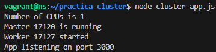
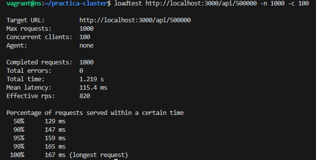
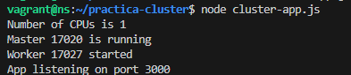
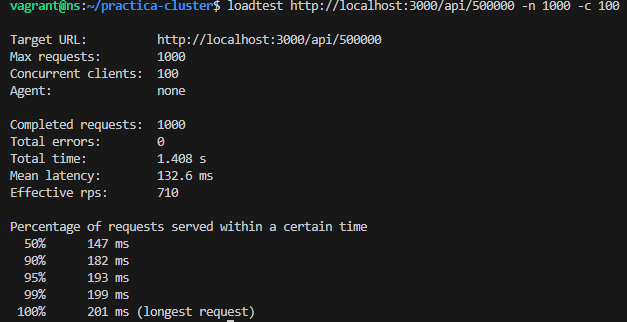
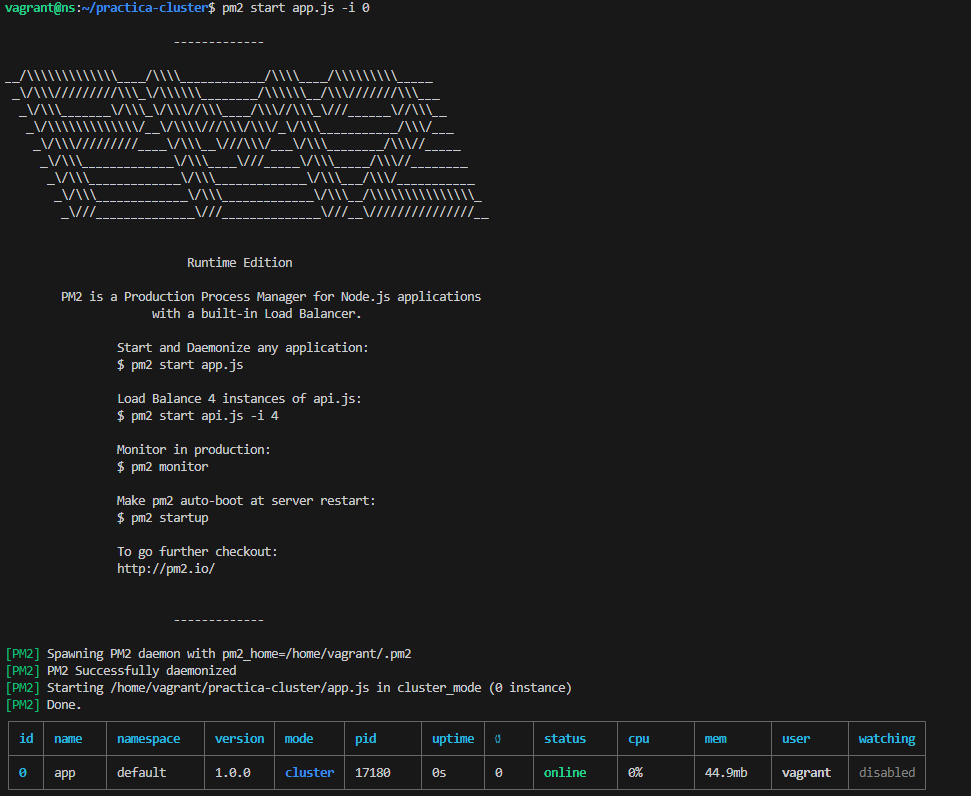
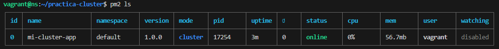
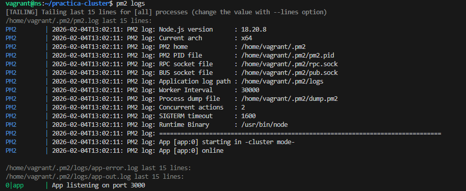
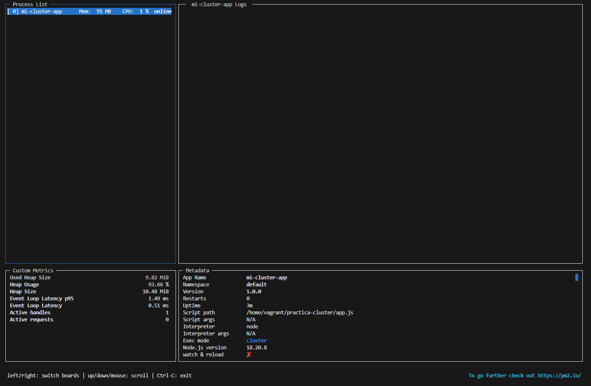

# Despliegue de una aplicación en cluster con Node Express

**Alumno:** Antonio Benítez García

**Módulo:** Despliegue de Aplicaciones Web

**Curso:** 2025-2026

---

## 1. Introducción

En esta práctica se documenta el análisis de rendimiento y escalabilidad de una aplicación **Node.js**. Al ser Node.js un entorno *single-threaded* (hilo único) por defecto, las operaciones pesadas pueden bloquear el servidor. El objetivo de esta práctica es demostrar este bloqueo y solucionarlo implementando **Clustering** (aprovechamiento de múltiples núcleos CPU) y gestionando el despliegue con la herramienta profesional **PM2**.

---

## 2. El Problema: Bloqueo del Event Loop

### Ejecución en Hilo Único
Inicialmente, arrancamos la aplicación básica (`app.js`) que se ejecuta en una sola instancia.

Al acceder a la ruta raíz `/`, la respuesta es inmediata ("Hello World").

### Demostración del Bloqueo
Sin embargo, al acceder a una ruta que realiza un cálculo intensivo (`/api/5000...`), el hilo único de Node.js se satura procesando el bucle. Esto provoca que el servidor quede "congelado" e incapaz de responder a otras peticiones hasta que termina el cálculo.

---

## 3. Solución 1: Cluster Nativo de Node.js

Para solucionar el problema anterior, utilizamos el módulo nativo `cluster`. Esto permite crear una arquitectura Maestro-Trabajador, donde se lanza una instancia de la aplicación (Worker) por cada núcleo disponible en la CPU.

Como se observa en la captura, el proceso Maestro (`Master`) inicializa los trabajadores (`Workers`). Si un worker se bloquea, los otros siguen disponibles para atender peticiones concurrentes.

---

## 4. Métricas de Rendimiento (Loadtest)

Para cuantificar la mejora, realizamos pruebas de estrés utilizando la herramienta `loadtest`.

### Prueba A: Sin Cluster
Lanzamos la prueba contra la aplicación en modo hilo único.

**Resultado:** El rendimiento es bajo debido a la saturación del único núcleo disponible.

### Prueba B: Con Cluster
Repetimos la misma prueba contra la aplicación clusterizada.

**Resultado:** Se observa una mejora significativa en las peticiones por segundo (RPS) y una mejor gestión de la concurrencia.

---

## 5. Administración Profesional con PM2

Gestionar los clusters manualmente mediante código es complejo y propenso a errores. Para un entorno de producción, utilizamos **PM2**, un gestor de procesos avanzado con balanceador de carga integrado.

### Inicialización del Cluster
Arrancamos la aplicación utilizando PM2 en modo cluster (`-i 0` para usar todos los núcleos) o mediante un archivo `ecosystem.config.js`.

### Gestión de Procesos
Podemos visualizar el estado de las instancias en cualquier momento mediante el comando `pm2 ls`. Vemos cómo PM2 mantiene los procesos en estado "online".

### Logs Unificados
PM2 centraliza los registros (logs) de todos los hilos, permitiendo ver la actividad de todo el cluster en una sola pantalla.

### Monitorización en Tiempo Real
Mediante el comando `pm2 monit`, accedemos a un panel de control que muestra el consumo de CPU y Memoria RAM de cada instancia individualmente.

### Zero Downtime Reload (Recarga sin caídas)
Una de las características más importantes es la capacidad de desplegar cambios sin detener el servicio. El comando `pm2 reload` reinicia los workers secuencialmente (uno a uno).

---

## 6. Cuestión Teórica

**Pregunta:** *En las pruebas realizadas, se observó que para tareas muy triviales (cargas muy pequeñas), el servidor sin cluster respondía ligeramente más rápido que el servidor con cluster. ¿A qué se debe esto?*

**Respuesta:**
Esto se debe al fenómeno conocido como **Overhead** (Sobrecarga de gestión).
El sistema de clustering introduce una capa adicional de complejidad: el proceso maestro debe recibir la petición, ejecutar el algoritmo de balanceo y comunicarse con el worker mediante IPC (Inter-Process Communication).
* Cuando la tarea es **extremadamente rápida** (microsegundos), se tarda más tiempo en gestionar el reparto de la tarea que en ejecutarla.
* El clustering es realmente efectivo y necesario para tareas de **uso intensivo de CPU** o alta concurrencia, donde el tiempo de procesamiento justifica la pequeña sobrecarga de gestión.

---